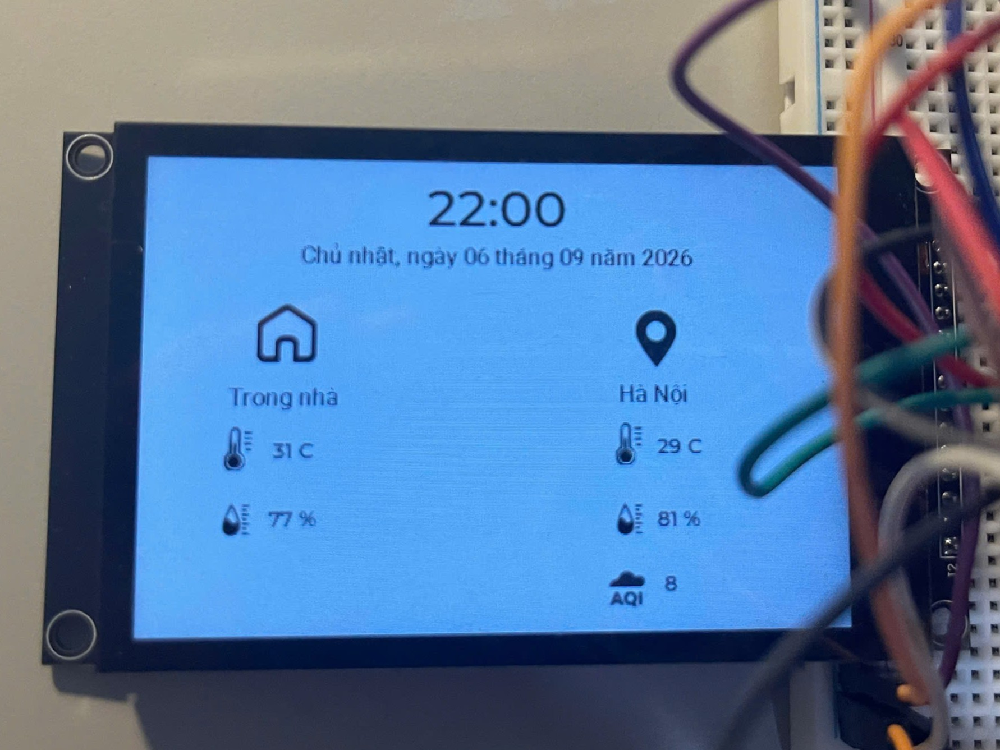
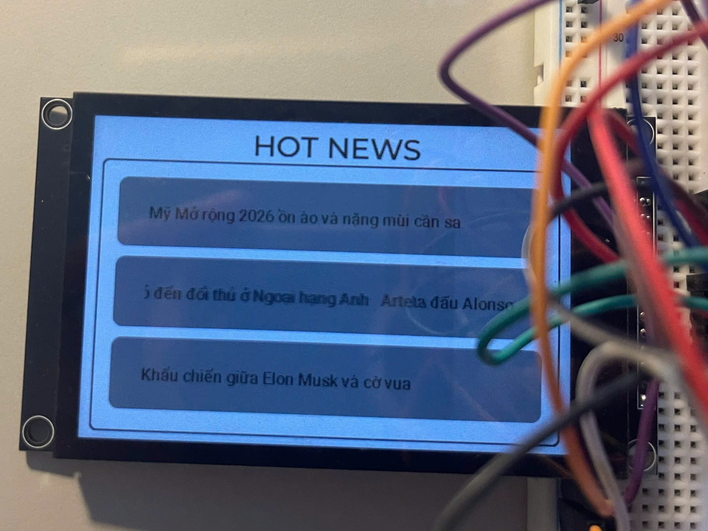
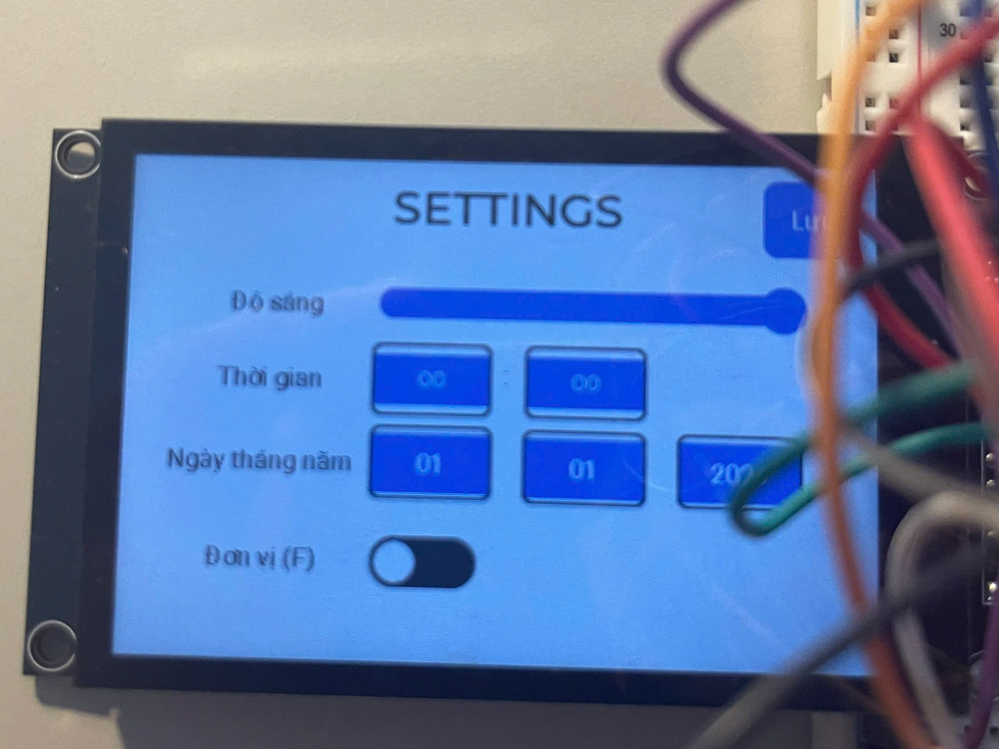
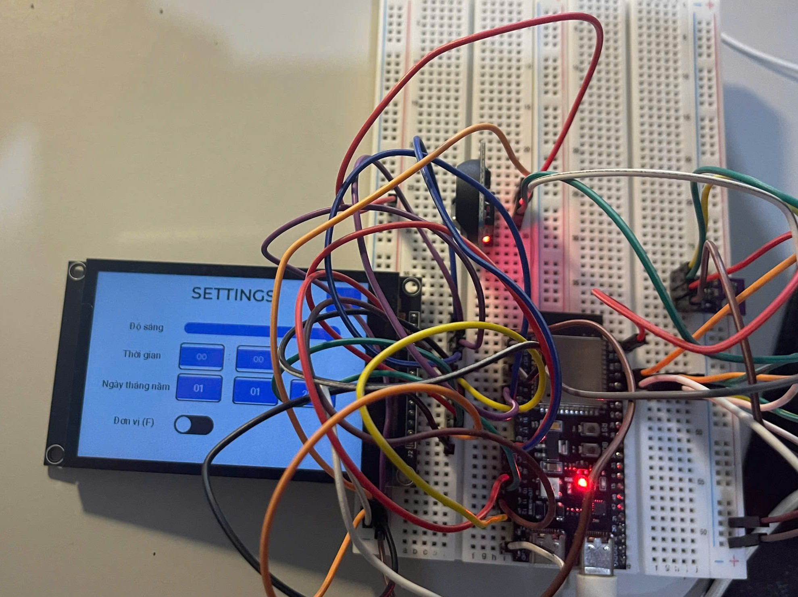

# ESP32-S3 Desk Information Display

An embedded **desk information dashboard** built with **ESP32-S3**, **ESP-IDF**, **FreeRTOS**, and **LVGL**.

The project combines a touchscreen graphical interface with local sensor data, an RTC, Wi-Fi connectivity, and online information services. The display provides time/date, indoor environment data, outdoor weather, AQI, and sports news in a compact desktop interface.

---

## 📌 Overview

The system is designed around an ESP32-S3 and a 480 × 320 TFT LCD.

It collects:

- **Indoor temperature and humidity** from AHT30
- **Date and time** from DS3231 RTC
- **Outdoor weather and humidity** from OpenWeatherMap
- **Air Quality Index (AQI)** from WAQI
- **Sports news headlines** from a VNExpress RSS feed through RSS2JSON

Users can interact with the system through a capacitive touchscreen to switch screens, adjust display brightness, change the temperature unit, and set the RTC date/time.

---

## ✨ Features

- 🌡️ Read indoor temperature and humidity from **AHT30**
- 🕒 Real-time clock using **DS3231**
- 📅 Display date, time, and day of the week
- 🌤️ Retrieve outdoor weather information through **OpenWeatherMap API**
- 🌫️ Retrieve air-quality information through **WAQI API**
- 📰 Retrieve news through an RSS-to-JSON service
- 📱 4.0-inch-class **480 × 320 TFT LCD** graphical interface
- 👆 Capacitive touchscreen using **FT6336U**
- 🎨 GUI developed with **LVGL 9.5** and **SquareLine Studio**
- 💡 Adjustable LCD brightness using **LEDC PWM**
- 🌡️ Switch between Celsius (°C) and Fahrenheit (°F)
- ⚙️ Touchscreen settings for brightness and RTC time/date
- 🔄 FreeRTOS tasks for GUI, sensors, RTC, and network services

---

## 🧰 Hardware

| Component | Function |
|---|---|
| ESP32-S3 | Main MCU |
| ST7796 TFT LCD | 480 × 320 graphical display |
| FT6336U | Capacitive touchscreen controller |
| AHT30 | Indoor temperature & humidity sensor |
| DS3231 | Real-time clock |
| Wi-Fi | Internet connection |

---

## 🔌 Pin Configuration

### ST7796 TFT LCD — SPI

| Signal | ESP32-S3 |
|---|---:|
| MOSI | GPIO 11 |
| SCLK | GPIO 12 |
| CS | GPIO 10 |
| DC | GPIO 9 |
| RST | GPIO 8 |
| Backlight | GPIO 4 |
| MISO | Not used |

Display resolution: 480 × 320 pixels


SPI clock: 80 MHz


### FT6336U Touch — I2C

| Signal | ESP32-S3 |
|---|---:|
| SDA | GPIO 6 |
| SCL | GPIO 7 |
| INT | GPIO 3 |
| I2C address | 0x38 |

I2C clock: 400 kHz


### AHT30 + DS3231 — I2C

The AHT30 and DS3231 share a separate I2C bus.

| Signal | ESP32-S3 |
|---|---:|
| SDA | GPIO 2 |
| SCL | GPIO 1 |

| Device | I2C address |
|---|---:|
| AHT30 | 0x38 |
| DS3231 | 0x68 |

I2C clock: 100 kHz


---

## 🏗️ Software Architecture

The application is divided into independent ESP-IDF components.

```text
                         ESP32-S3
                            │
          ┌─────────────────┼─────────────────┐
          │                 │                 │
       Display            Sensors          Network
          │                 │                 │
     ┌────┴────┐       ┌────┴────┐       ┌────┴─────┐
     │ ST7796  │       │  AHT30  │       │  Wi-Fi   │
     │ FT6336U │       │ DS3231  │       │ API Task │
     └────┬────┘       └────┬────┘       └────┬─────┘
          │                 │                 │
          └─────────────────┼─────────────────┘
                            │
                           LVGL
                            │
                     Touchscreen GUI
```

### FreeRTOS tasks

| Task | Core | Priority | Function |
|---|---:|---:|---|
| `GUI_Task` | Core 1 | 5 | LVGL timer handling and GUI rendering |
| `RTC_Task` | Core 0 | 3 | Read DS3231 every second |
| `aht30_task` | Core 1 | 5 | Read AHT30 every 2 seconds |
| `API_Task` | Core 0 | 3 | Retrieve AQI, weather and news |

The GUI task is responsible for LVGL processing. Sensor/network tasks update application data and use LVGL locking when directly updating GUI objects.

---

## 📂 Project Structure

```text
Prj_DeskInfoDisplay/
│
├── components/
│   │
│   ├── api_service/
│   │   ├── api_service.c
│   │   ├── api_service.h
│   │   ├── CMakeLists.txt
│   │   └── idf_component.yml
│   │
│   ├── app/
│   │   └── led_brightness/
│   │       ├── led_brightness.c
│   │       ├── led_brightness.h
│   │       └── CMakeLists.txt
│   │
│   ├── config/
│   │   ├── include/
│   │   │   ├── config.h
│   │   │   └── config_example.h
│   │   └── CMakeLists.txt
│   │
│   ├── display_drv/
│   │   ├── display_drv.c
│   │   ├── display_drv.h
│   │   └── CMakeLists.txt
│   │
│   ├── sensors/
│   │   ├── aht30/
│   │   │   ├── aht30.c
│   │   │   ├── aht30.h
│   │   │   └── CMakeLists.txt
│   │   │
│   │   └── rtc_ds3231/
│   │       ├── rtc_ds3231.c
│   │       ├── rtc_ds3231.h
│   │       └── CMakeLists.txt
│   │
│   ├── UI/
│   │   ├── screens/
│   │   │   ├── ui_Screen1.c
│   │   │   ├── ui_Screen2.c
│   │   │   └── ui_Screen3.c
│   │   ├── images/
│   │   ├── fonts/
│   │   ├── ui.c
│   │   ├── ui.h
│   │   ├── ui_events.c
│   │   └── ui_helpers.c
│   │
│   └── wifi_drv/
│       ├── wifi_drv.c
│       ├── wifi_drv.h
│       └── CMakeLists.txt
│
├── main/
│   ├── main.c
│   └── idf_component.yml
│
├── CMakeLists.txt
├── .gitignore
└── README.md
```


---

## 🖥️ User Interface

### Screen 1 — Dashboard

The main screen displays the current system information.



Swipe left to open **Hot News**.

### Screen 2 — Hot News

The system displays three news headlines retrieved from the online RSS feed.

Long headlines use circular scrolling to fit the 480 × 320 display.



Swipe right to return to the previous screen.

### Screen 3 — Settings

The settings screen provides:



The selected time/date is converted to the required DS3231 format and written to the RTC through I2C.

---

## 🌐 Online APIs

The application retrieves information from external web services:

- OpenWeatherMap — outdoor weather
- WAQI — air quality
- RSS-to-JSON service — news feed

---

## 🔐 Credential Configuration

The project keeps private credentials outside the public repository.

The configuration component contains:

```text
components/config/include/
├── config.h
└── config_example.h
```

### `config.h`

This file contains the real local credentials:

```c
#define WIFI_SSID              "YOUR_WIFI_SSID"
#define WIFI_PASSWORD          "YOUR_WIFI_PASSWORD"

#define WAQI_TOKEN             "YOUR_WAQI_TOKEN"
#define OPENWEATHER_API_KEY    "YOUR_OPENWEATHER_API_KEY"
```

`config.h` is ignored by Git:

```gitignore
components/config/include/config.h
```

### `config_example.h`

This file is safe to commit and acts as a template for other users.

After cloning the repository:

```text
config_example.h
       │
       └── copy/rename ──> config.h
                              │
                              └── add your credentials
```

---

## 🛠️ Software Requirements

- ESP-IDF
- ESP32-S3 toolchain
- VS Code + ESP-IDF extension (recommended)
- USB connection to ESP32-S3

The project uses the following ESP-IDF managed dependencies:

```yaml
lvgl/lvgl: ^9.5.0
espressif/esp_lcd_st7796: ^1.4.0
espressif/cjson: "*"
```

The GUI was generated with:

```text
SquareLine Studio 1.6.2
LVGL 9.5
```

---

## 🚀 Build and Flash

### 1. Clone the repository

```bash
git clone https://github.com/<username>/Prj_DeskInfoDisplay.git
cd Prj_DeskInfoDisplay
```

### 2. Configure credentials

Create your local configuration file from the example:

```text
components/config/include/config_example.h
```

Create:

```text
components/config/include/config.h
```

and enter your own:

```c
#define WIFI_SSID              "YOUR_WIFI_SSID"
#define WIFI_PASSWORD          "YOUR_WIFI_PASSWORD"

#define WAQI_TOKEN             "YOUR_WAQI_TOKEN"
#define OPENWEATHER_API_KEY    "YOUR_OPENWEATHER_API_KEY"
```

### 3. Select ESP32-S3

```bash
idf.py set-target esp32s3
```

### 4. Build

```bash
idf.py build
```

### 5. Flash

```bash
idf.py flash
```

### 6. Monitor serial output

```bash
idf.py monitor
```

Or:

```bash
idf.py flash monitor
```

---


## 🔄 Data Flow

```text
AHT30 ───────────────┐
                     │
DS3231 ──────────────┤
                     │
                     ▼
                  ESP32-S3
                     │
          ┌──────────┴──────────┐
          │                     │
       Local Data           Wi-Fi Network
          │                     │
          │          ┌──────────┼──────────┐
          │          │          │          │
          │       Weather      AQI        News
          │          │          │          │
          └──────────┴──────────┴──────────┘
                     │
                     ▼
                  LVGL GUI
                     │
                     ▼
               ST7796 Display
                     ▲
                     │
                FT6336U Touch
```

---

## 📊 Refresh Rates

| Data | Update interval |
|---|---:|
| RTC | 1 second |
| AHT30 | 2 seconds |
| Weather | 15 minutes |
| AQI | 15 minutes |
| News | 15 minutes |
| LVGL GUI | Continuously |

The API task starts after the ESP32 successfully obtains an IP address from Wi-Fi.

---

## 💡 Technical Highlights

This project demonstrates practical embedded-system development using:

- ESP32-S3 dual-core MCU
- ESP-IDF component architecture
- FreeRTOS task creation and core pinning
- I2C master driver
- SPI display communication
- ST7796 LCD driver
- FT6336U capacitive touch
- LVGL 9.5 GUI
- SquareLine Studio UI design
- HTTP client
- HTTPS certificate bundle
- REST-style API communication
- JSON parsing with cJSON
- RTC time management
- BCD conversion
- PWM-based LCD brightness control
- Event-driven touchscreen interface
- Git/GitHub credential management

---

## 🔮 Future Improvements

- Store Wi-Fi credentials using NVS instead of source configuration.
- Add NTP time synchronization.
- Add Wi-Fi connection status to the dashboard.
- Add more weather information such as weather condition and wind speed.
- Add AQI level classification and graphical indicators.
- Add a boot/loading screen.
- Improve UI animations and transitions.
- Add power-saving/sleep modes.

---

## 📷 Demo




Video Demo: [](https://www.youtube.com/watch?v=urLbEkBrgyA&t=35s)

---

## 👨‍💻 Author

**Nguyen Thanh Trung**

Embedded Systems / Electronics Engineering

GitHub:

```text
https://github.com/thanhtrung2303
```

---

## 📄 License

This project is intended for educational and portfolio purposes.

Third-party libraries and components remain subject to their respective licenses.
